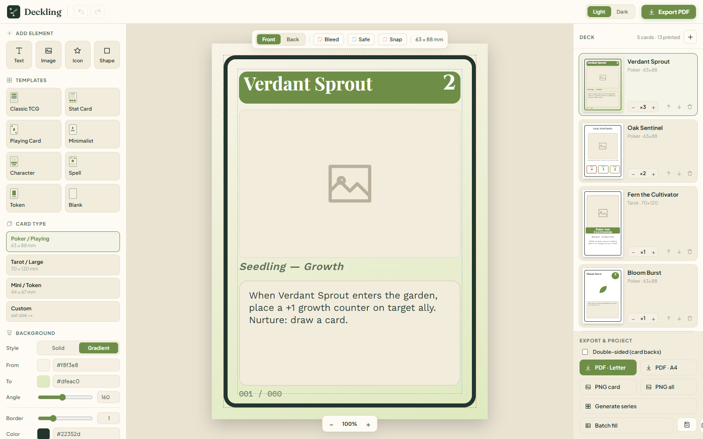

# Deckling

**A free, browser-based card maker for prototyping board & card games.**
*De ideas pequeñas, grandes juegos.* Design cards at true print proportions, drop
in art, text and icons, and export print-ready PDF cut sheets, PNGs and project
files — no signup, no install, everything stays in your browser.

🔗 **Live app:** https://sacaste.github.io/deckling/



## Features

- **True-to-print canvas** — Poker, Tarot, Mini/Token or a custom size, with bleed and safe-area guides.
- **Free element editing** — text, images, icons and shapes; move, resize, rotate, layer, and set opacity, with undo/redo.
- **Multi-select** — shift-click or marquee to select many elements, then move the group, align, distribute, duplicate or delete them together.
- **Snapping & alignment guides** — smart guides while dragging (hold <kbd>Alt</kbd> to bypass), plus align-to-card buttons.
- **Templates & icons** — 8 starting card templates and a built-in icon library, styled in the Deckling palette.
- **Card backs & double-sided export** — one shared back per deck with mirrored, print-ready duplex PDF pages.
- **Batch tools** — a deck panel with per-card quantities, a Series Generator, and CSV batch fill.
- **Export anywhere** — PDF cut sheets (Letter / A4), PNG (single card or all), and JSON save/load.
- **Themes** — Light and Dark.

## Getting started

Deckling is a single static page — there is nothing to build or install.

**Just use it:** open the [live app](https://sacaste.github.io/deckling/).

**Run it locally:**

```bash
git clone https://github.com/SaCaste/deckling.git
cd deckling
python -m http.server 8987   # or any static file server
# then open http://localhost:8987/index.html
```

You can also open `index.html` directly from disk — it works from `file://`.

## How it works

- **Single file:** the entire app lives in [`index.html`](index.html) as one React 18 class component (`React.createElement`), with no build step.
- **Vendored dependencies:** React, ReactDOM and [jsPDF](https://github.com/parallax/jsPDF) are bundled in [`vendor/`](vendor/), so the app has no runtime JavaScript CDN dependency and works offline. (Web fonts are loaded from Google Fonts as a progressive enhancement and fall back to system fonts if unavailable.)
- **Your data stays with you:** there is no backend and no account. Projects live in your browser and are only ever saved when you export a JSON / PDF / PNG file yourself.

## Deploying your own copy

Because it's static, any static host works. The simplest is **GitHub Pages**:
Settings → Pages → *Deploy from a branch* → `main` / `root`. It will be served at
`https://<user>.github.io/<repo>/`. Netlify, Vercel and Cloudflare Pages work the
same way — point them at the repo (or drag the folder in), no build command needed.
